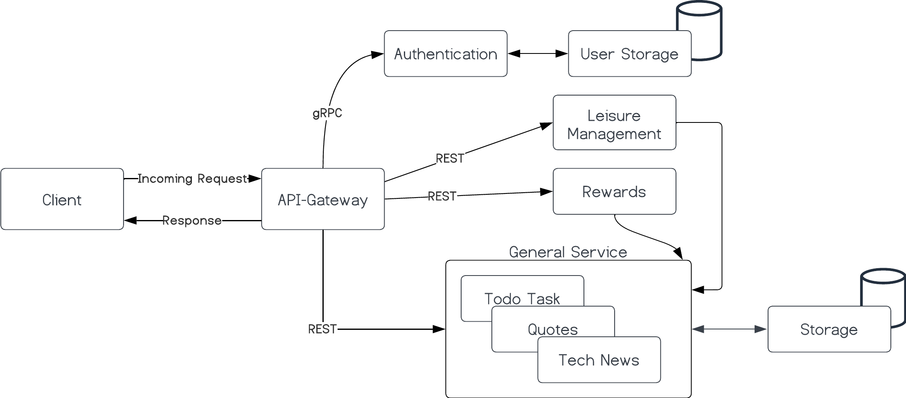

<h1 align="center">
  
</h1>


<p align="center">


</p>

<!--  -->

<p align="center">
<b>Opendesk</b> is a platform implemented to increase productivity for employers by giving them a wide range of tools to effectively manage their duties. One of this app's primary advantages is its capacity to reward employers for tasks performed, which promotes a healthy work atmosphere and motivates employees to provide their best effort. Also, Opendesk is intended to assist staff members in taking care of their mental health and lowering their stress levels at work, both of which may have a substantial influence on their general well-being and productivity.
</p>


## What it does
Employers can quickly prioritise their activities and make calendars with Opendesk, which helps them remain on track and meet deadlines. This may be especially useful when organising holidays or other activities with family and friends because the app makes sure that duties are finished on schedule, allowing workers to enjoy their time off stress-free.

Moreover, Opendesk offers a platform for keeping track of worker progress and making sure that everyone is remaining focused and encouraged. The software offers a central spot for tracking progress and highlighting areas where more support may be required, which may be especially useful for managers who are in charge of managing big teams or many projects at once.

All things considered, Opendesk is a vital tool for any business trying to boost output, lessen stress and anxiety, and create a pleasant workplace. This software will undoubtedly grow to be a vital component of any employer's toolset because to its user-friendly layout and robust capabilities.

### 🏛️ Application Architecture



### 👌 Features / Services offered

- [ ] Stress and anxiety management
- [ ] Mental boostup
- [ ] Task progress management
- [ ] Task based rewards
- [ ] Employer leisure planning

### ⚡Performance 

- [ ] Application response time

## How we built it


## Environment Variables

To run this project, you will need to add the following environment variables to your `.env` file

- `MONGO_URI`
- `APPLICATION_HOST`
- `PORT`


## API Reference

#### Get all items

```http
  GET /api/items
```

| Parameter | Type     | Description                |
| :-------- | :------- | :------------------------- |
| `api_key` | `string` | **Required**. Your API key |

#### Get item

```http
  GET /api/items/${id}
```

| Parameter | Type     | Description                       |
| :-------- | :------- | :-------------------------------- |
| `id`      | `string` | **Required**. Id of item to fetch |


## Run Locally

- Clone the project
  ```bash
    git clone https://github.com/<user-name>/opendesk/
  ```
### Running Frontend

- Go to the project directory and Install client dependencies
  ```bash
    cd opendesk/client
    npm install
  ```
- Start the client server
  ```bash
    npm run start 
  ```
### Running Backend

- Install Go from [Go.dev](https://go.dev/)
- ```bash
    go get .
    go run cmd/main.go
  ```
- ```
  protoc --go_out=. --go_opt=paths=source_relative --go-grpc_out=. --go-grpc_opt=paths=source_relative service.proto

  protoc --go_out=. --go-grpc_out=. rpc_user.proto 
  ```


## Authors
- [Siddhant Prateek Mahanayak](github.com/siddhantprateek)

## License

[](https://choosealicense.com/licenses/mit/)
